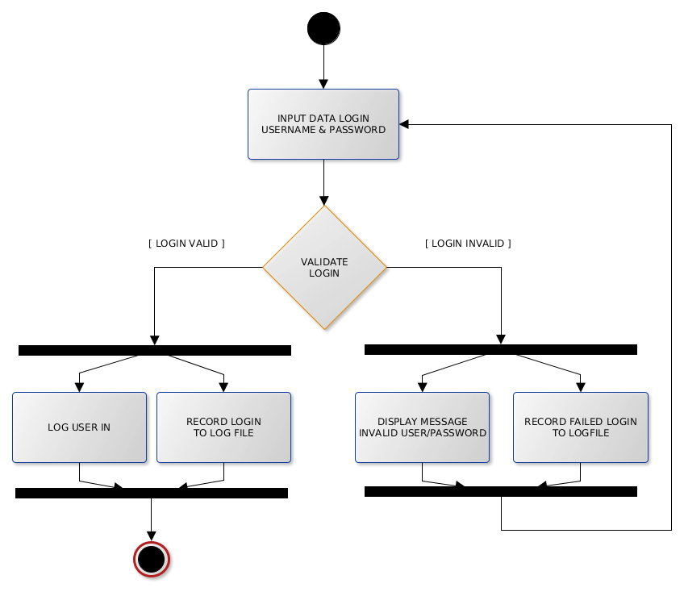
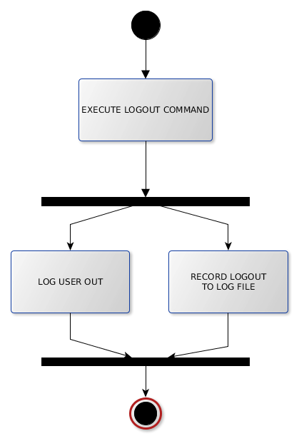
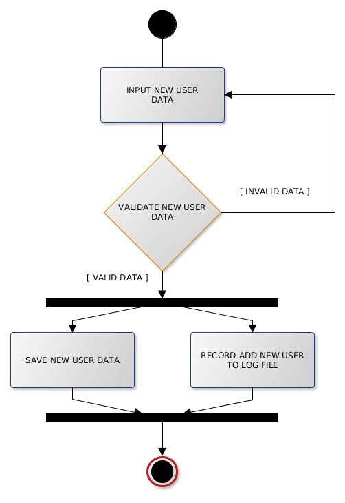
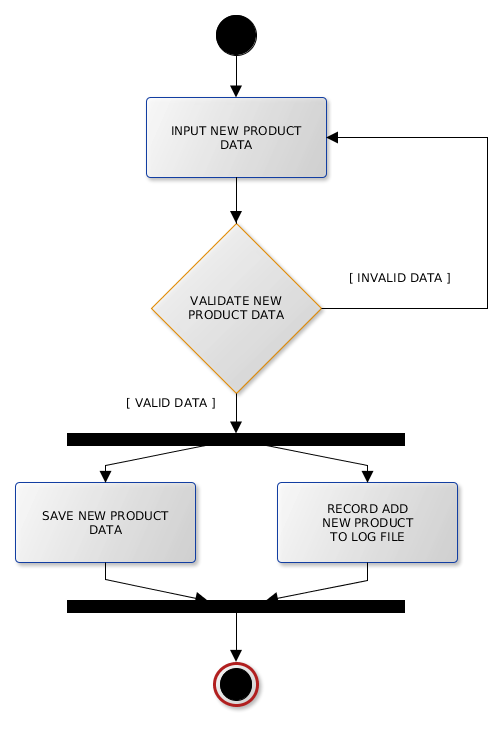
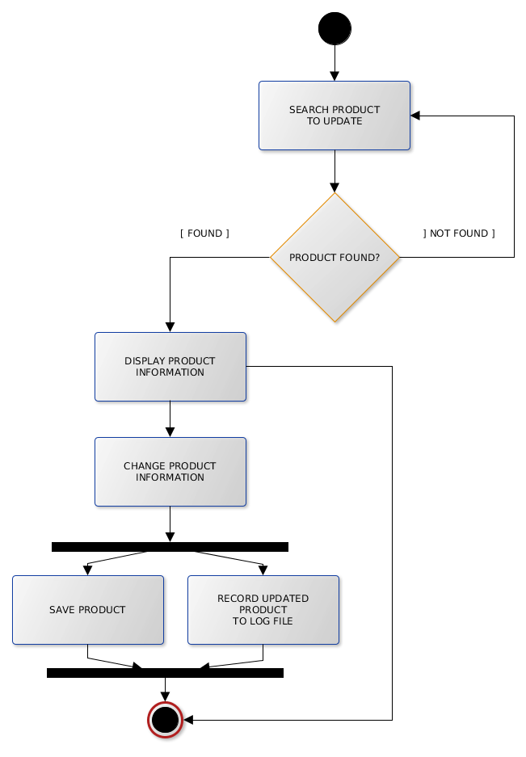
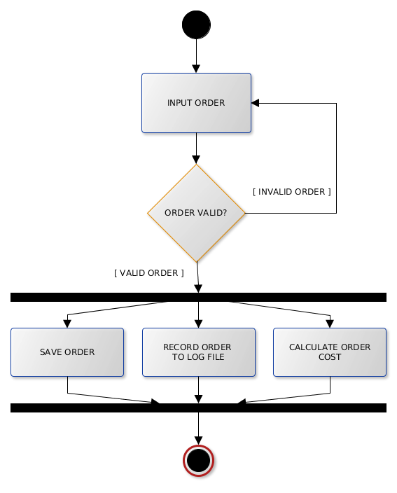
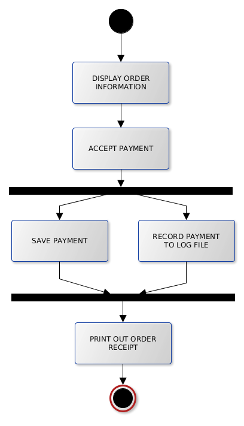
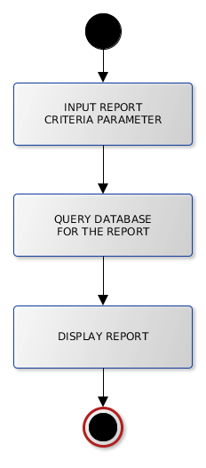
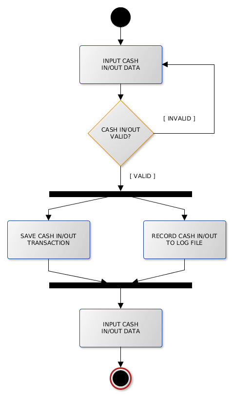
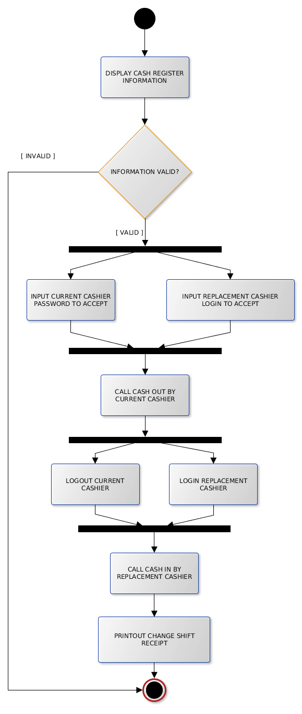

{\rtf1\ansi\ansicpg1252\cocoartf1138\cocoasubrtf510
{\fonttbl\f0\fswiss\fcharset0 Helvetica;}
{\colortbl;\red255\green255\blue255;}
\margl1440\margr1440\vieww10800\viewh8400\viewkind0
\pard\tx720\tx1440\tx2160\tx2880\tx3600\tx4320\tx5040\tx5760\tx6480\tx7200\tx7920\tx8640\pardirnatural

\f0\fs24 \cf0 ## Activity Diagram\
\
Tampilan *activity diagram* mirip dengan *flowchart*. Kedua diagram ini memiliki tujuan yang sama yaitu menggambarkan\
flow proses yang akan diimplementasikan ke dalam program.\
\
Narasi pada *use case diagram* mendeskripsikan flow proses dengan menggunakan kata-kata. *Activity diagram*\
menggambarkan flow proses menggunakan simbol-simbol.\
\
*Activity diagram* untuk *use case* Coffee Shop:\
\
1. Login\
\
   \
   \
2. Logout\
\
   \
   \
3. Add new user\
\
   \
\
4. Remove user (disable user)\
\
   \
   \
5. Update user account\
\
   \
   \
6. Add new product\
\
   \
   \
7. Remove product\
\
   \
   \
8. Update product\
\
   \
   \
9. Order\
\
   \
   \
10. Payment\
\
    \
    \
11. POS & Cash Register Report\
\
    \
    \
12. Cash In/Out\
\
    \
    \
13. Ganti Shift\
\
    \
}